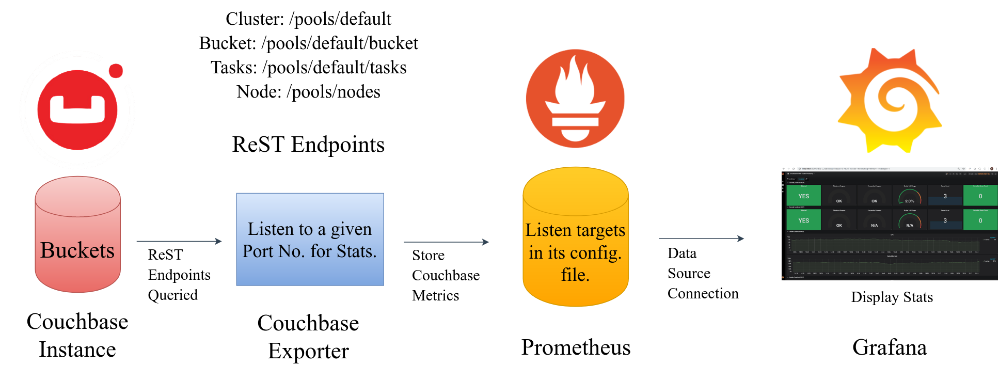
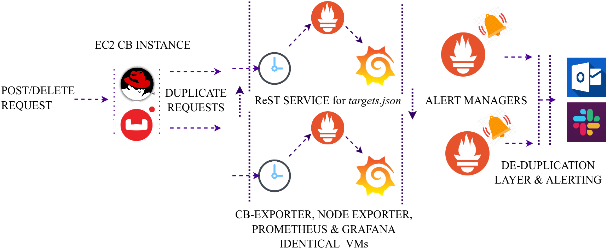

## Dissection of 'Couchbase Monitoring Integration with Prometheus and Grafana'

This repository contains implementation of the concepts explained in the presentation used in the `Couchbase Connect.ONLINE 2020` session `Automating Couchbase Monitoring`. Also, it covers all the concepts presented in the `Hackernoon` article `Dissection of 'Couchbase Monitoring Integration with Prometheus and Grafana'`. The presentation used for the session is attached in the github repository for reference as well, . You can also login to the Couchbase Connect.ONLINE portal for the video session regarding the same.

#### An in-depth discussion on Prometheus based alerting and dashboarding tool that displays time-series data on Grafana with metrics that are exported from couchbase server's ReST endpoints with the help of Couchbase-Exporter tool. Below, we state the sequence order in which the metric data flows.  

#### Couchbase Database Server &#8594; Couchbase-Exporter &#8594; Prometheus &#8594; Grafana

This repository elaborates upon components explored for this monitoring & alerting tool. Like dashboarding, alerting, building custom cb-exporter, automating instance addition to prometheus targets, doing predictive analytics for machine failure etc.

## Directory Structure Description

Each directory contains altered files, source code and methodology followed for that component from the . Also, alternate paths and ideas are stated in abstract manner with generic implementations that weren't pursued in the case-study as per the time constraints.

* __custom-dashboards:__ JSON file for creating custom dashboard metrics with node level stats as well being captured.
* __rest-service:__  HTTP Server that adds/remove prometheus targets & start/stop couchbase-exporter processes. This server is the basic idea behind the automation and synchronization amongst different tools in this monitoring solution.
* __prometheus-analysis:__  Configuration file changes & targets.json files are provided. Plus, small code snippet to create a Prometheus service and setting up `mesh` cluster between two AlertManager instances.
* __couchbase-exporter-analysis:__ It contains necessary code files to add a new kind of metrics based on `/indexes` endpoints for building a new version of couchbase-exporter instance from the original one. Please, incorporate the existing files with current `couchbase-exporter` by _totvslabs_ just to get started working with the couchbase-exporter building process.
* __predictive-analytics-and-maintenance:__ This predictive analytics projects forecast system states for the near future and do outlier analysis of the already made forecast data. Also, sanity checks to keep the model performance with the advent of new data are made as well.

## Architecture Diagrams

Below we state the automation architecture diagram for the monitoring solution to synchronize these different tools under consideration. After, that we provide the high availability architecture under which this monitoring solution should be deployed.

  

  <b>Figure 1:</b> Automation architecture for adding & removing a Couchbase instances from the monitoring & alerting solution in place.

  

  <b>Figure 2:</b> High availability scalable solution that runs identical monitoring instances to provide 24x7 alerting capabilities.

