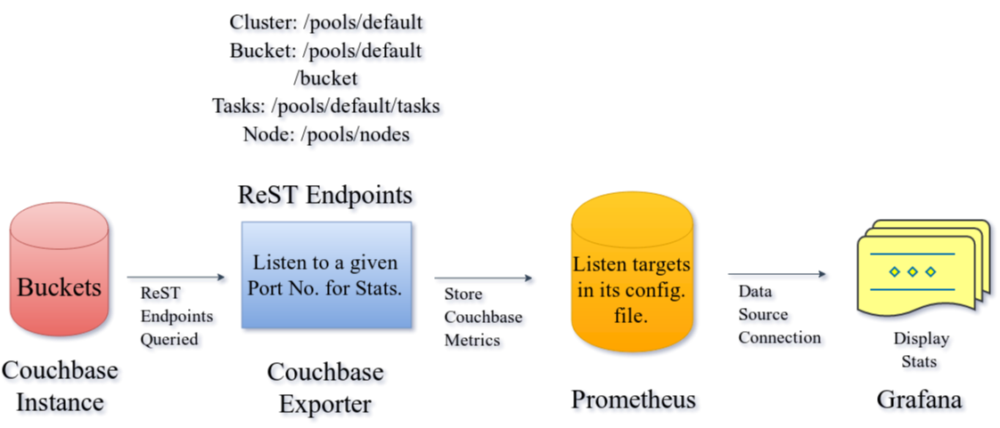
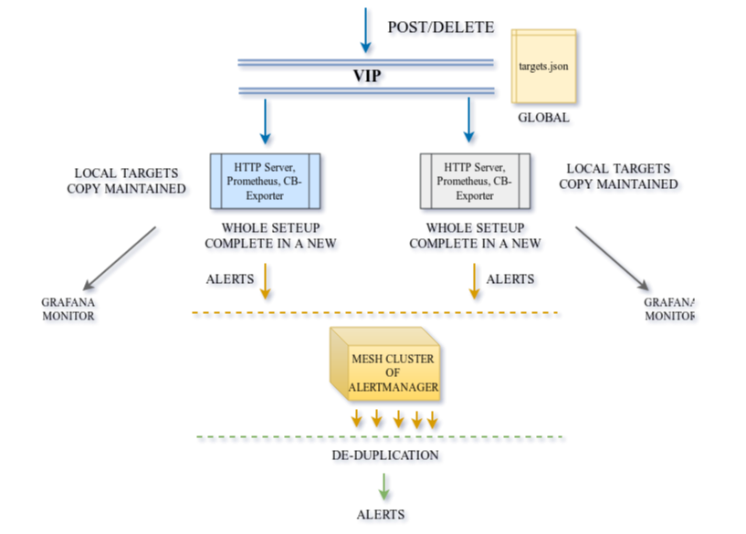

# Dissection of 'Couchbase Monitoring Integration with Prometheus and Grafana'

### Couchbase Database Server -> Couchbase-Exporter -> Prometheus -> Grafana, sequence highlights the flow of metric data.  

#### This repository contains an in-depth discussion on prometheus based alerting and dashboarding tool that displays time-series data on Grafana with metrics that are exported from couchbase server's ReST endpoints with the help of couchbase-exporter tool.  

This repository elaborates upon components explored for this alerting tool. Like dashboarding, alerting, building custom cb-exporter, automating instance addition to prometheus targets etc.

## Description

Each directory contains altered files, source code and methodology followed for that component from the mentioned couchbase article. Also, alternate paths and ideas are mentioned that weren't pursued as per time constraints.

* __custom-dashboards:__ JSON file for creating custom dashboard with node level stats also in `dashboard.json` file.
* __rest-service:__  HTTP Server that adds/remove prometheus targets & start/stop couchbase-exporter processes.
* __prometheus-analysis:__  Configuration file changes & targets.json files present. Plus, small code snippet to create a Prometheus service.

## Architecture Diagrams

#### The basic Out-Of-The-Box integration can be viewed from the below specified architecture diagram as specified in the couchbase blog.

#### A high availability completely scalable solution with full recovery mechanism solution is specified below.

