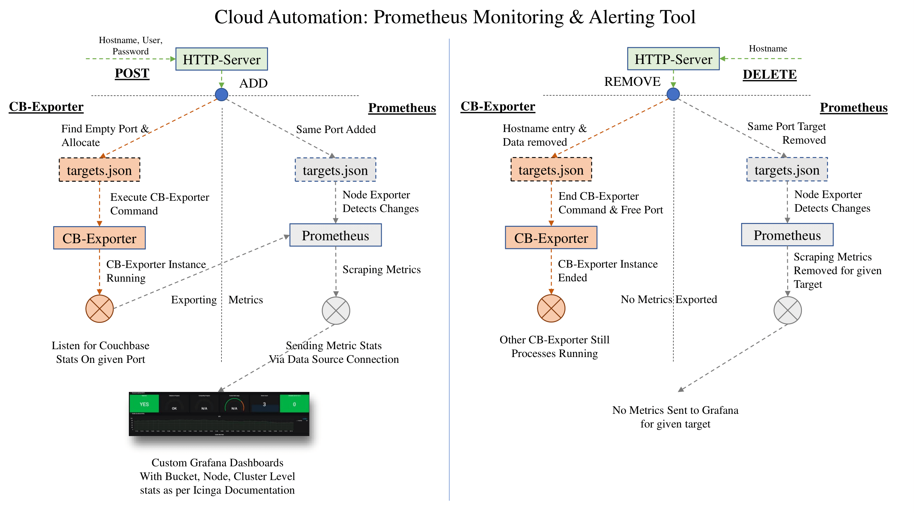

# ReST API Service

This is a generic HTTP Server (for python3) and a TCP based Server (for python2). This implementation utilizes most importanly the util functions that does all the work in background. Do refer, these created functions to understand the basic functionality of this automation tool.

The directory of this tool is alongside the given directories in the project setup `prometheus-2.9.2.xxx/` , `couchbase-exporter/` and `http-automation-server`. Hence, the commands executed in the util scripting tool are equivalent to that only.

### Make curl requests to POST, DELETE, GET and VIEW target Couchbase VMs.

This solution start & remove couchbase-exporter processes for given instances and updates targets.json of both Prometheus datastore  server & couchbase-exporter accordingly.

__Note:__ We have tested this automation server for RHEL and Ubuntu environments only. For windows we haven't tested anything and are not planning to proceed also.

### Working Architectures

#### Automation Provided by our HTTP Server Solution

### Starting Instuction

* Select an empty port and proper accessible url by changing values in specified line `TCPServer(('tild23.del.com',43918), ServiceHandler)` for running the server. Similarly, can be done for python3 HTTP server.
* After, that execute the following command: `python rest_server.py`. We will prefer if you make a service out of it also or use a `nohup` command variant.

### Server Queries samples

* __VIEW:__    `curl -X VIEW --data "tild23.del.com" server-url:port-no`
* __GET:__    `curl -X GET server-url:port-no`
* __POST:__    `curl -X POST --data "Hostname,UserName,Password" server-url:port-no`
* __DELETE:__    `curl -X DELETE --data "Hostname" server-url:port-no`
