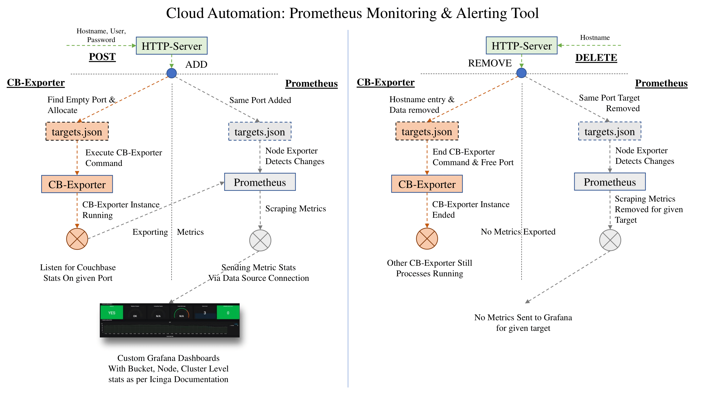

# ReST API Service

This is a generic HTTP Server _(for Python3)_ and a TCP based Server _(for Python2)_. These server implementations utilizes most importantly the `utils.py` functions that do all the work in background. Do refer, these created functions to understand the basic functionality of this automation tool.

The directory of this tool is alongside the given directories in the project setup `prometheus-2.9.2.xxx/` , `couchbase-exporter/` and `rest-service`. Hence, the commands executed in the util scripting tool are designed or hard-coded for that setup only.

### Make curl requests to POST, DELETE, GET and VIEW target Couchbase VMs.

This solution starts & removes couchbase-exporter processes for given instances and updates `targets.json` of both Prometheus datastore server & rest-automation-server accordingly. Both, Prometheus datastore and rest-automation-server maintains separate yet consistent copies for their own reference

__Note 1:__ We have tested this automation server for the RHEL environment only. For windows and other linux platforms we haven't tested anything and are not planning to proceed also.

__Note 2:__ For high-availability we can run two identical servers having the setup of identical Prometheus, CB-Exporter, Grafana, Node Exporter and AlertManager with mesh connections instances running independently. Now, from the user's end ReST query from Couchbase EC2 instance is required to be made twice to those different servers running these identical processes. With this we'll have a much simpler implementation for high availability.

### Working Architectures

#### Automation process flow provided by our HTTP Server Solution.

### Starting Instruction

* Select an empty port and proper accessible url by changing values in specified line `TCPServer(('tild23.del.com',43918), ServiceHandler)` for running the server. Similarly, can be done for python3 HTTP server.
* After that, execute the following command: `python rest_server.py`. We will prefer if you make a service out of it also or use a `nohup` command variant.

### Server Queries samples

* __VIEW:__    `curl -X VIEW --data "tild23.del.com" server-url:port-no`
* __GET:__    `curl -X GET server-url:port-no`
* __POST:__    `curl -X POST --data "Hostname,UserName,Password" server-url:port-no`
* __DELETE:__    `curl -X DELETE --data "Hostname" server-url:port-no`
